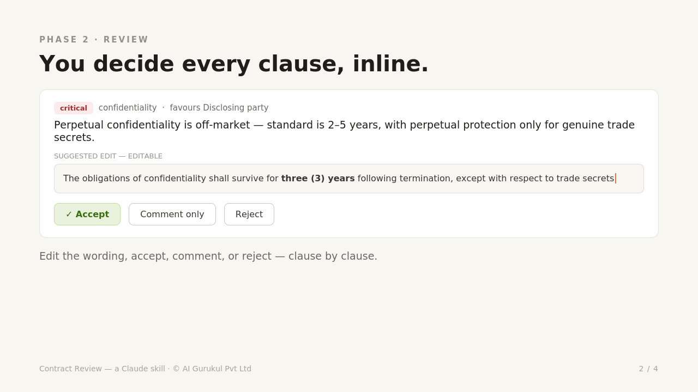
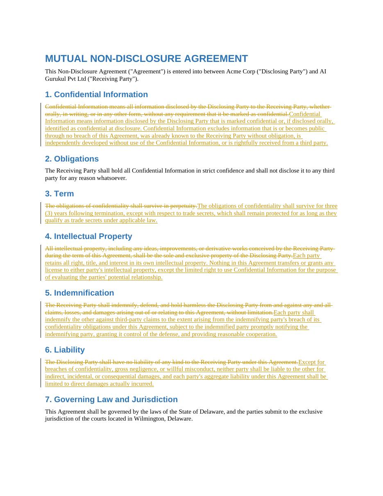

# Contract Review

A Claude skill that reads an agreement from **your** side, scores how fair it is,
and hands back a redlined document — tracked changes and threaded comments,
authored as you — in one pass.


**[▶ Full-quality video + walkthrough](https://saarthios.github.io/contract-review/)** &nbsp;·&nbsp; [download the MP4](media/demo.mp4)

---

## What it does

Give it an NDA, MSA, DPA, employment, or licensing agreement. It:

1. **Analyses** — fixes which side you're on (favorability is directional: the same
   indemnity is a gift or a landmine depending on the party), reads the whole
   document, scores every clause against a market-standard playbook, and flags what
   matters — including clauses that are *missing*.
2. **Reviews** — an interactive review where each finding shows the issue, the
   language that favours the other side, and an editable suggested edit. Accept,
   rewrite, comment, or reject — clause by clause.
3. **Applies** — one click sends your decisions straight back to Claude.
4. **Redlines** — regenerates the original `.docx` with tracked changes and native
   comments authored under your name, replies to and **closes** the counterparty's
   existing comment threads where you agree, and returns a plain-language changelog.




Coverage: confidentiality, IP & copyright, indemnification, limitation of
liability, penalties, SLAs, term & termination, non-compete, governing law &
jurisdiction, assignment, warranties, and data protection.

## Install

### Claude Code (plugin marketplace)

```bash
/plugin marketplace add SaarthiOS/contract-review
/plugin install contract-review@saarthios-skills
```

Then just bring Claude a contract (see Usage). Update later with
`/plugin marketplace update saarthios-skills`.

### claude.ai (Pro, Max, Team, or Enterprise, with code execution)

Zip the skill folder and upload it under **Settings → Features → Skills**:

```bash
cd plugins/contract-review/skills && zip -r contract-review.zip contract-review
```

Upload `contract-review.zip`. (On claude.ai, custom skills are per-user; each
teammate uploads it once. Team/Enterprise owners can provision it org-wide from
Organization settings.)

### Local development / testing

```bash
git clone https://github.com/SaarthiOS/contract-review
/plugin marketplace add ./contract-review
/plugin install contract-review@saarthios-skills
```

## Usage

```
Review this NDA from our side as the receiving party and redline anything one-sided.
```

If Claude can't tell which side you're on, it asks once. Work through the review,
hit **Apply**, and it produces the marked-up `.docx` plus a changelog. In a fresh
session, re-attach the original document and the analysis so it can anchor the edits.

## What's in here

```
.claude-plugin/marketplace.json          # marketplace catalog (Claude Code)
plugins/contract-review/
  .claude-plugin/plugin.json             # plugin manifest
  skills/contract-review/
    SKILL.md                             # the skill: 4-phase workflow + guardrails
    references/                          # clause playbook, scoring rubric, schemas, recipes
    scripts/
      apply_decisions.py                 # decisions + original doc -> redlined .docx
      ooxml.py                           # self-contained WordprocessingML engine
      build_review_widget.py             # analysis -> interactive review widget
      build_review_html.py               # analysis -> standalone HTML review (fallback)
    assets/review-template.html          # standalone review UI
docs/index.html                          # GitHub Pages landing page
media/                                   # demo video + screenshots
```

## Notes

- **Self-contained.** The redline engine (`scripts/ooxml.py`) is original code
  covering comments, reply threading, thread resolution, and run-merging. It has
  **no external skill dependency** and makes **no network calls**. Optional legacy
  `.doc` input uses LibreOffice (`soffice`) if present.
- **Not legal advice.** This is decision support. Have a qualified lawyer review
  before signing.
- **PDF.** Word-grade tracked changes don't exist natively in PDF; the skill
  converts a PDF to `.docx` for a true redline rather than faking it.

## License

MIT © AI Gurukul Pvt Ltd. See [LICENSE](LICENSE).
